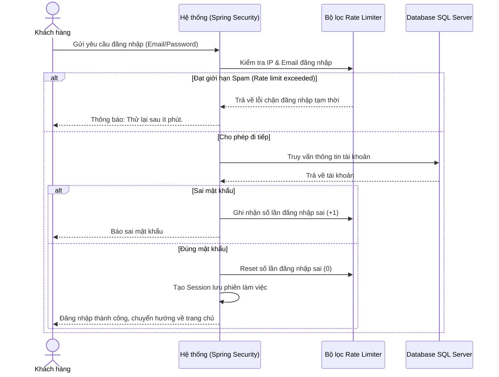
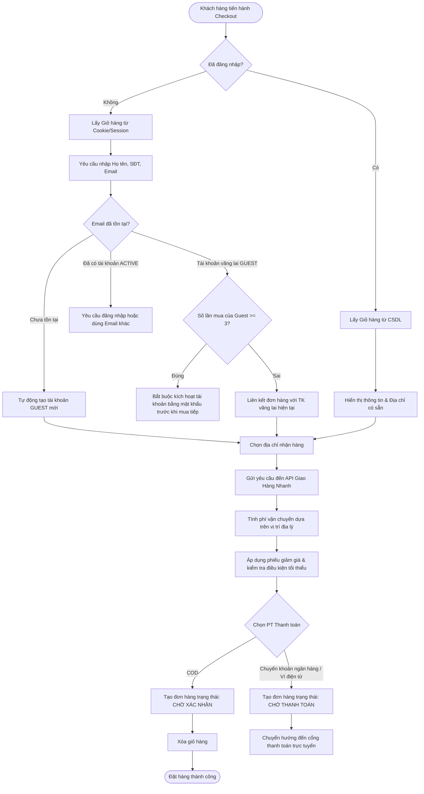
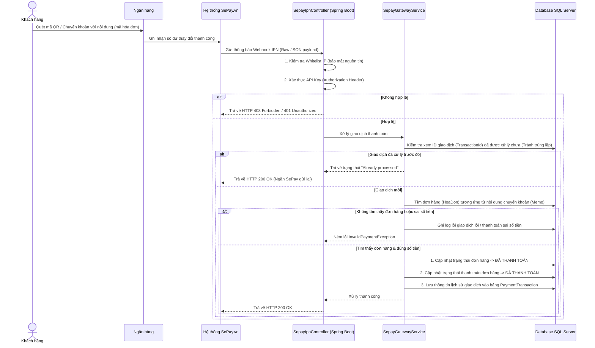
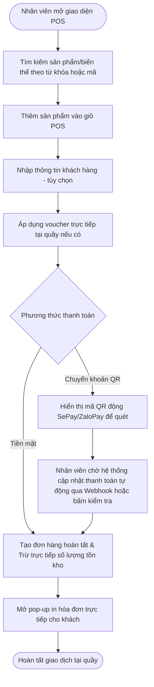
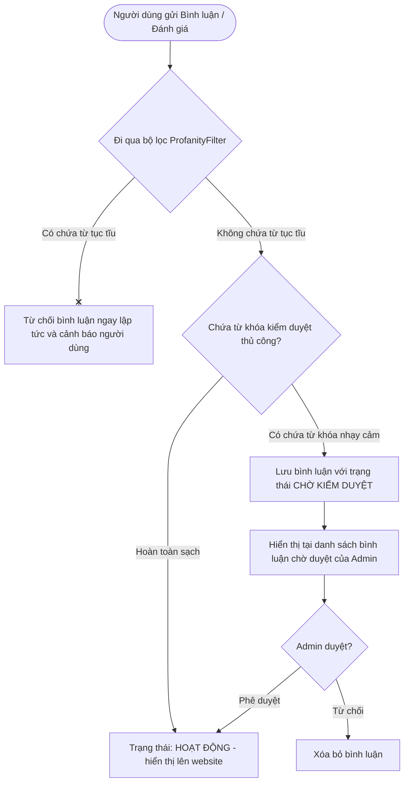
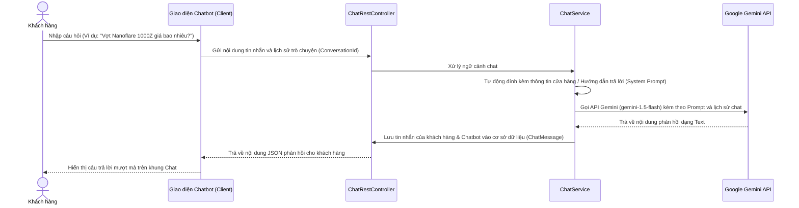

# Sơ đồ Cấu trúc Dự án & Luồng Hoạt động (SMASH-VN)

Tài liệu này cung cấp cái nhìn chi tiết về cấu trúc thư mục hiện tại của dự án **SMASH-VN (Shop bán vợt cầu lông)** và mô tả chi tiết luồng hoạt động của các chức năng cốt lõi trong hệ thống.

---

## 1. Sơ đồ Cấu trúc Thư mục Dự án

Dưới đây là sơ đồ cấu trúc thư mục chính của dự án Maven Spring Boot:

```text
SMASH-VN_Shop-ban-vot-cau-long/
├── .env                         # Lưu trữ các biến môi trường cấu hình (DB, API Keys, SMTP, Webhook Secrets)
├── .env.example                 # Tệp mẫu khai báo biến môi trường chuẩn
├── pom.xml                      # Cấu hình Maven Build & Dependencies (Spring Boot, Security, Thymeleaf, JPA, Jsoup, Tika)
├── deploy.bat                   # Kịch bản tự động hóa Build & Deploy trên Windows
├── deploy.js                    # Script Node.js tự động kiểm tra cổng dịch vụ & triển khai
├── docs/                        # Thư mục tài liệu báo cáo kiến trúc tương tác & báo cáo kiểm thử
│   ├── project-structure.html   # Trang tài liệu kiến trúc tương tác trực quan & Call Flow Map
│   └── log.html                 # Báo cáo kết quả kiểm thử toàn diện
├── payment/                     # Script phụ trợ tích hợp cổng thanh toán trực tuyến
├── uploads/                     # Thư mục lưu trữ hình ảnh tải lên động (Sản phẩm, Đánh giá, Avatar, Banner)
└── src/
    ├── main/
    │   ├── java/com/smashvn/shop/   # Mã nguồn Backend (Java Spring Boot MVC)
    │   │   ├── SmashVnApplication.java # Lớp khởi chạy chính của ứng dụng
    │   │   │
    │   │   ├── config/              # Các cấu hình hệ thống
    │   │   │   ├── AdminInterceptor.java        # Kiểm tra phiên làm việc & quyền truy cập trang quản trị
    │   │   │   ├── AsyncConfig.java             # Cấu hình xử lý bất đồng bộ (@EnableAsync)
    │   │   │   ├── DotenvEnvironmentPostProcessor.java # Tự động nạp biến môi trường từ .env
    │   │   │   ├── GeminiHttpClientConfig.java   # Cấu hình HTTP Client kết nối Google Gemini AI API
    │   │   │   ├── GhnConfig.java               # Cấu hình kết nối API Giao Hàng Nhanh
    │   │   │   ├── PlaintextPasswordMigrator.java # Migration tự động băm mật khẩu cũ sang BCrypt khi boot
    │   │   │   ├── ProfessionalDataSeeder.java   # Khởi tạo dữ liệu mẫu phong phú khi CSDL trống
    │   │   │   ├── SecurityConfig.java          # Cấu hình Spring Security (URL Authorization, BCrypt, OAuth2)
    │   │   │   ├── SepayConfig.java             # Cấu hình tích hợp thanh toán ngân hàng SePay
    │   │   │   ├── ShopContactProperties.java   # Nạp thông tin liên hệ cửa hàng từ properties
    │   │   │   ├── SpringContextHelper.java     # Tiện ích truy xuất Spring Beans tĩnh
    │   │   │   ├── UploadPathVerifier.java      # Tự động tạo và kiểm tra thư mục uploads/
    │   │   │   ├── UploadSecurityFilter.java    # Bảo mật tệp tin upload tránh mã độc (Shell scripts)
    │   │   │   └── WebMvcConfig.java            # Cấu hình Spring MVC Interceptors & Resource Handlers
    │   │   │
    │   │   ├── constant/            # Các Enum hằng số và cấu hình thuộc tính sản phẩm
    │   │   │   ├── CategoryType.java            # Enum loại danh mục (Vợt, Giày, Quần áo, Phụ kiện...)
    │   │   │   ├── DanhMucIds.java              # ID danh mục cố định hệ thống
    │   │   │   └── SanPhamAttributeConfig.java  # Cấu hình thuộc tính động cho từng loại sản phẩm
    │   │   │
    │   │   ├── controller/          # Các tầng tiếp nhận và điều hướng Request (MVC & REST Controllers)
    │   │   │   ├── admin/           # Controllers dành cho Admin & Staff
    │   │   │   │   ├── AdminBienTheController.java  # Quản lý Biến thể sản phẩm (SKU, màu, size, tồn kho)
    │   │   │   │   ├── AdminBlogController.java     # Quản lý bài viết tin tức & kinh nghiệm cầu lông
    │   │   │   │   ├── AdminController.java         # Dashboard quản trị tổng quát
    │   │   │   │   ├── AdminDangNhapController.java # Đăng nhập/Đăng xuất Admin & Staff
    │   │   │   │   ├── AdminDanhGiaController.java  # Quản lý & kiểm duyệt đánh giá sản phẩm
    │   │   │   │   ├── AdminDanhMucController.java  # Quản lý danh mục sản phẩm (Cha - Con)
    │   │   │   │   ├── AdminKhuyenMaiController.java# Quản lý Phiếu giảm giá & Đợt giảm giá
    │   │   │   │   ├── AdminNhanVienController.java # Quản lý tài khoản & phân quyền nhân viên
    │   │   │   │   ├── AdminPaymentTransactionController.java # Tra cứu lịch sử giao dịch thanh toán
    │   │   │   │   ├── AdminPosController.java      # Bán hàng trực tiếp tại quầy (POS)
    │   │   │   │   ├── AdminSanPhamController.java  # Quản lý danh sách sản phẩm & thuộc tính
    │   │   │   │   ├── AdminThongKeController.java  # Thống kê doanh thu & biểu đồ bán hàng
    │   │   │   │   └── CommentModerationAdminController.java # Quản trị bình luận bị gắn cờ vi phạm
    │   │   │   ├── advice/          # Global Notification Advice
    │   │   │   │   └── GlobalNotificationAdvice.java # Tự động nạp giỏ hàng & thông báo vào Model
    │   │   │   ├── api/             # REST Controllers cung cấp API cho Client/Frontend
    │   │   │   │   ├── CategoryAttributeRestController.java # API lấy thuộc tính động theo danh mục
    │   │   │   │   ├── ChatbotProductsRestController.java # API cung cấp dữ liệu sản phẩm cho AI
    │   │   │   │   ├── ChatbotRestController.java   # API Chatbot tư vấn qua Google Gemini AI
    │   │   │   │   ├── GhnRestController.java       # Tích hợp địa giới & tính phí ship Giao Hàng Nhanh
    │   │   │   │   ├── LocationRestController.java  # Lấy danh mục Tỉnh/Huyện/Xã Việt Nam
    │   │   │   │   ├── NewsletterApiController.java # Đăng ký nhận email tin tức/khuyến mãi
    │   │   │   │   ├── SearchApiController.java     # Tìm kiếm nhanh & gợi ý từ khóa sản phẩm
    │   │   │   │   └── ShippingApiController.java   # Tính toán phí vận chuyển đơn hàng
    │   │   │   ├── blog/            # Controller bài viết tin tức & bình luận
    │   │   │   ├── home/            # Controller giao diện trang chủ, banner, khuyến mãi, liên hệ
    │   │   │   ├── order/           # Controller Giỏ hàng (Cart) & Thanh toán (Checkout)
    │   │   │   ├── payment/         # Controller nhận Webhook SePay IPN & giả lập giao dịch
    │   │   │   ├── product/         # Controller danh sách sản phẩm, lọc nâng cao, chi tiết & wishlist
    │   │   │   └── user/            # Controller hồ sơ khách hàng, sổ địa chỉ, lịch sử đơn hàng, OTP
    │   │   │
    │   │   ├── dao/                 # Tầng Data Access Object hỗ trợ các truy vấn dữ liệu thủ công
    │   │   ├── dto/                 # Data Transfer Objects trao đổi dữ liệu Frontend - Backend
    │   │   ├── entity/              # Các JPA Entities ánh xạ các bảng CSDL SQL Server (31+ tables)
    │   │   ├── exception/           # Xử lý ngoại lệ tập trung (GlobalExceptionHandler & Custom Exceptions)
    │   │   ├── migration/           # Kịch bản chuyển đổi dữ liệu tự động (EmployeeMigrationRunner)
    │   │   ├── repository/          # Tầng tương tác CSDL Spring Data JPA (31 Repositories)
    │   │   ├── scheduler/           # Tác vụ lập lịch ngầm tự động (CommentModerationScheduler)
    │   │   ├── security/            # Tầng bảo mật nâng cao chống SPAM & Brute-force
    │   │   │   ├── ForgotPasswordRateLimiter.java# Giới hạn tần suất gửi OTP quên mật khẩu
    │   │   │   ├── LoginRateLimiter.java        # Giới hạn tần suất đăng nhập sai
    │   │   │   └── RegisterRateLimiter.java     # Giới hạn tần suất đăng ký tài khoản
    │   │   │
    │   │   ├── service/             # Tầng xử lý Logic Nghiệp vụ chính của hệ thống
    │   │   │   ├── admin/           # Nghiệp vụ quản trị (Biến thể, Khách hàng, Khuyến mãi, POS, Thống kê)
    │   │   │   ├── api/             # Nghiệp vụ API giao hàng GHN & tính phí ship vùng miền
    │   │   │   ├── blog/            # Nghiệp vụ bài viết & tự động kiểm duyệt bình luận
    │   │   │   ├── common/          # Nghiệp vụ quản lý lưu trữ tệp tin (FileStorageService)
    │   │   │   ├── impl/            # Implementations cho Chatbot AI Gemini, Newsletter & Giá
    │   │   │   ├── order/           # Nghiệp vụ giỏ hàng, Guest Checkout & Đơn hàng
    │   │   │   ├── payment/         # Nghiệp vụ thanh toán chuyển khoản SePay IPN
    │   │   │   ├── product/         # Nghiệp vụ sản phẩm, thương hiệu, danh mục, đánh giá, tính khuyến mãi
    │   │   │   └── user/            # Nghiệp vụ người dùng, sổ địa chỉ, đổi mật khẩu, OTP
    │   │   │
    │   │   └── util/                # Các class tiện ích (ProfanityFilter, VoucherCalculator, SpecUtils...)
    │   │
    │   └── resources/
    │       ├── application.properties # File cấu hình hệ thống Spring Boot chính
    │       ├── static/              # Tài nguyên tĩnh (CSS, JS, Images)
    │       └── templates/           # Giao diện Thymeleaf HTML (Admin & Customer)
    └── test/                        # Mã nguồn kiểm thử Unit & Integration test
```

---

## 2. Luồng Hoạt động các Chức năng Chính

Dưới đây là sơ đồ và mô tả luồng hoạt động đối với các nghiệp vụ cốt lõi trong hệ thống.

### 2.1. Luồng Đăng ký & Đăng nhập (Auth Flow)

Hệ thống hỗ trợ 2 hình thức: đăng nhập thường và đăng nhập qua mạng xã hội (Google OAuth2).
Để bảo mật, hệ thống áp dụng `Rate Limiter` ngăn chặn brute-force.



---

### 2.2. Luồng Giỏ hàng & Đặt hàng (Cart & Checkout Flow)

Hệ thống hỗ trợ song song hai cơ chế: **Khách hàng đã đăng nhập** và **Khách vãng lai (Guest Checkout)**.



> [!NOTE]
> Khi **Khách vãng lai** đặt hàng thành công lần đầu tiên, hệ thống sẽ tự động gửi một email bất đồng bộ kích hoạt tài khoản (`autoRegisterGuest` -> `sendOrderAndAccountNotification`). Khách hàng có thể truy cập đường link trong email để thiết lập mật khẩu và nâng cấp lên tài khoản `ACTIVE` chính thức.

---

### 2.3. Luồng Thanh toán Trực tuyến (Payment Gateway Webhook/IPN Flow)

Hệ thống hỗ trợ tích hợp sâu với **ZaloPay** (Ví điện tử) và **SePay** (Tự động nhận chuyển khoản ngân hàng qua IPN Webhook).

#### 2.3.1. Luồng thanh toán tự động qua chuyển khoản Ngân hàng (SePay IPN Webhook)



---

### 2.4. Luồng Bán hàng tại Quầy (POS System Flow)

Dành cho Nhân viên và Quản lý tại cửa hàng để tạo nhanh hóa đơn bán hàng trực tiếp cho khách.



---

### 2.5. Luồng Kiểm duyệt Đánh giá & Bình luận (Comment & Review Moderation Flow)

Để tránh spam và chứa ngôn từ phản cảm, các bình luận của bài viết Blog hoặc đánh giá sản phẩm sẽ đi qua bộ lọc kiểm duyệt tự động trước khi lưu vào CSDL.



---

### 2.6. Luồng Chatbot Gemini AI tư vấn khách hàng (AI Support Chatbot Flow)

Hệ thống tích hợp một chatbot tư vấn dựa trên mô hình Gemini AI để hỗ trợ khách hàng nhanh chóng.



---

*Tài liệu được tạo tự động bởi Antigravity để phản ánh chính xác mã nguồn dự án hiện tại.*
