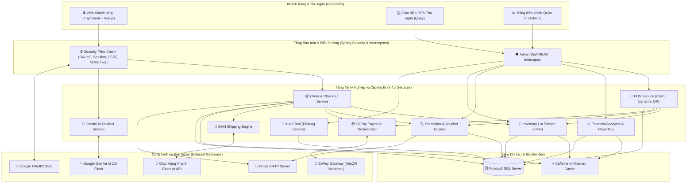

<h1 align="center">🏸 SMASH-VN — HỆ THỐNG THƯƠNG MẠI ĐIỆN TỬ & BÁN HÀNG CẦU LÔNG ĐA KÊNH</h1>

<p align="center">
  <em>Giải pháp toàn diện kết hợp E-Commerce bán hàng trực tuyến, Bán hàng tại quầy (POS), Quản lý kho hàng theo Lô (FIFO), Tích hợp AI Trợ lý thông minh và Báo cáo tài chính chuyên sâu.</em>
</p>

<p align="center">
  <a href="#-tính-năng-nổi-bật"></a>
  <a href="#-công-nghệ-sử-dụng"></a>
  <a href="#-công-nghệ-sử-dụng"></a>
  <a href="#-công-nghệ-sử-dụng"></a>
  <a href="#-tác-giả--liên-hệ"></a>
</p>

<p align="center">
  <a href="https://discord.gg/tinhxuannn"></a>
  <a href="https://facebook.com/TinhXuannn"></a>
  <a href="https://instagram.com/TinhXuannn"></a>
</p>

---

## 📌 MỤC LỤC

1. [Giới thiệu tổng quan](#-giới-thiệu-tổng-quan)
2. [Kiến trúc hệ thống & Luồng nghiệp vụ](#-kiến-trúc-hệ-thống--luồng-nghiệp-vụ)
3. [Các phân hệ tính năng chính](#-các-phân-hệ-tính-năng-chính)
   - [3.1. Cửa hàng trực tuyến (Storefront / E-Commerce)](#31-cửa-hàng-trực-tuyến-storefront--e-commerce)
   - [3.2. Bán hàng tại quầy (POS - Point of Sale)](#32-bán-hàng-tại-quầy-pos---point-of-sale)
   - [3.3. Thống kê & Báo cáo tài chính (Analytics & Reporting)](#33-thống-kê--báo-cáo-tài-chính-analytics--reporting)
   - [3.4. Quản lý Khuyến mãi (Promotions & Vouchers)](#34-quản-lý-khuyến-mãi-promotions--vouchers)
   - [3.5. Quản trị hệ thống & Kiểm toán (Admin & Audit Trail)](#35-quản-trị-hệ-thống--kiểm-toán-admin--audit-trail)
4. [Tích hợp dịch vụ bên thứ ba](#-tích-hợp-dịch-vụ-bên-thứ-ba)
5. [Công nghệ sử dụng (Tech Stack)](#-công-nghệ-sử-dụng)
6. [Cơ chế Bảo mật & Tính toàn vẹn](#-cơ-chế-bảo-mật--tính-toàn-vẹn)
7. [Yêu cầu hệ thống & Cài đặt](#-yêu-cầu-hệ-thống--cài-đặt)
8. [Cấu hình biến môi trường (.env)](#-cấu-hình-biến-môi-trường-env)
9. [Bộ nạp dữ liệu mẫu Dev (Data Seeder)](#-bộ-nạp-dữ-liệu-mẫu-dev-data-seeder)
10. [Tài khoản thử nghiệm (Test Accounts)](#-tài-khoản-thử-nghiệm-test-accounts)
11. [Cấu trúc thư mục dự án](#-cấu-trúc-thư-mục-dự-án)
12. [Tác giả & Đóng góp](#-tác-giả--đóng-góp)

---

## 📖 Giới thiệu tổng quan

**SMASH-VN** là nền tảng thương mại điện tử và quản lý bán lẻ chuyên biệt cho ngành cầu lông (vợt cầu lông, giày, balo, phụ kiện, quần áo thể thao). Hệ thống giải quyết trọn vẹn bài toán vận hành chuỗi bán lẻ thể thao hiện đại: từ trải nghiệm mua sắm mượt mà của khách hàng trên Web, bán hàng trực tiếp siêu tốc tại quầy (POS), quản lý kho hàng chuẩn theo Lô xuất nhập (FIFO), tích hợp tự động hóa vận chuyển & thanh toán QR ngân hàng, đến hệ thống báo cáo doanh thu tài chính chuẩn mực kế toán.

> [!IMPORTANT]
> **Trạng thái dự án**: Dự án mang tính chất **Đồ án tốt nghiệp / Học tập nghiên cứu**. Không sử dụng trực tiếp trong môi trường thương mại thực tế khi chưa qua các bước thẩm định bảo mật và thử nghiệm tải chuyên sâu.

---

## 🏗 Kiến trúc hệ thống & Luồng nghiệp vụ

Hệ thống được thiết kế theo mô hình kiến trúc phân lớp chuẩn của Spring Boot (**Controller - Service - Repository - Entity/DTO**), kết hợp các Service chuyên biệt xử lý Transaction, Caching, External Webhooks và Async Tasks.



---

## ✨ Các phân hệ tính năng chính

### 3.1. Cửa hàng trực tuyến (Storefront / E-Commerce)
- **Danh mục & Tìm kiếm thông minh**: Lọc sản phẩm đa chiều theo Danh mục (Vợt, Giày, Quần áo, Túi...), Thương hiệu (Yonex, Victor, Lining...), Khoảng giá, Trọng lượng (3U/4U/5U), Điểm cân bằng, Độ cứng thân vợt.
- **Biến thể sản phẩm thời gian thực**: Chọn màu sắc, kích cỡ, sức căng; tự động cập nhật giá niêm yết, giá khuyến mãi Flash Sale và số lượng tồn kho khả dụng.
- **Giỏ hàng đa năng**: Hỗ trợ đồng bộ giỏ hàng cho cả Khách vãng lai (*Guest Cart*) và Khách hàng đã đăng nhập tài khoản.
- **Quy trình Thanh toán & Đặt hàng (Checkout)**:
  - Tích hợp tính phí giao hàng tự động qua API Giao Hàng Nhanh (GHN) theo địa chỉ nhận hàng và trọng lượng gói.
  - Áp dụng mã Voucher giảm giá thông minh (kiểm tra điều kiện đơn tối thiểu, trần giảm giá).
  - Lựa chọn phương thức thanh toán linh hoạt: Thanh toán khi nhận hàng (COD) hoặc Chuyển khoản ngân hàng tự động qua SePay VietQR.
- **Trợ lý ảo AI Chatbot (Google Gemini)**: Hỗ trợ tư vấn vợt, lối chơi (tấn công, công thủ toàn diện, phản tạt), đề xuất sản phẩm theo mức ngân sách trực tiếp trên giao diện chat 24/7.
- **Đánh giá & Bình luận sản phẩm**: Hệ thống kiểm duyệt tự động (*Comment Moderation*) lọc các từ ngữ thô tục/nhạy cảm, phòng chống tấn công XSS bằng Jsoup.
- **Tra cứu đơn hàng trực tuyến**: Khách hàng vãng lai có thể tra cứu hành trình đơn hàng bằng Mã đơn hàng + SĐT/Email mà không bắt buộc phải đăng nhập.

---

### 3.2. Bán hàng tại quầy (POS - Point of Sale)
- **Giao diện Thu ngân tối ưu tốc độ**: Thao tác thêm sản phẩm bằng tìm kiếm nhanh tên/mã/thuộc tính, hỗ trợ lọc theo hãng và danh mục trong 1 màn hình.
- **Quản lý khách hàng tại quầy**:
  - Hỗ trợ bán nhanh cho **Khách Lẻ** vãng lai.
  - Tra cứu thông tin khách hàng thành viên (SĐT, Họ tên) để tích điểm và theo dõi lịch sử.
  - Modal tạo nhanh tài khoản khách hàng mới ngay tại quầy thu ngân (mã hóa mật khẩu BCrypt tự động).
- **Thanh toán Tiền mặt (Cash Flow)**:
  - Phím tắt chọn nhanh mệnh giá (`50k`, `100k`, `200k`, `500k`, `Đúng số tiền`).
  - Tự động tính toán tiền thối lại theo thời gian thực; cơ chế validate nghiêm ngặt chặn thanh toán khi khách đưa thiếu tiền.
- **Thanh toán Chuyển khoản QR (SePay Dynamic VietQR)**:
  - Sinh mã VietQR động chứa chính xác số tiền và cú pháp chuyển khoản đơn hàng (`HDSVN...`).
  - Hệ thống Polling ngầm (chu kỳ 3s) và Webhook IPN tự động bắt giao dịch thành công để chốt đơn ngay lập tức.
  - Nút xác nhận thủ công dự phòng khi ngân hàng khách bị chậm thông báo.
- **Trừ kho FIFO theo Lô (Inventory Lot Deduction)**:
  - Tự động nhóm các biến thể cùng thuộc tính, khóa chống Deadlock và trừ hàng tuần tự từ các Lô/Đợt nhập cũ nhất trước.
  - Cơ chế hoàn kho chính xác từng lô khi đơn chờ bị hủy.
- **In hóa đơn bán lẻ**: In trực tiếp hóa đơn chuẩn khổ K80 (80mm) hoặc khổ A5 ngay sau khi hoàn tất giao dịch.

---

### 3.3. Thống kê & Báo cáo tài chính (Analytics & Reporting)
Phân hệ Thống kê (`AdminThongKeService`) cung cấp góc nhìn tài chính chuẩn xác theo thời gian thực:
- **Nguyên tắc phân loại doanh thu kế toán chuẩn mực**:
  - `ACTUAL_REVENUE`: Doanh thu thực tế chỉ ghi nhận từ các đơn đã giao hàng thành công / hoàn tất (`da_giao`, `hoan_thanh`).
  - `ACTUAL_REVENUE_REVERSAL`: Ghi nhận giảm trừ doanh thu tự động khi có đơn phát sinh Trả hàng - Hoàn tiền (`REFUNDED`).
  - `PROJECTED_REVENUE`: Doanh thu dự kiến từ các đơn đang vận chuyển (phục vụ dự báo dòng tiền, không cộng gộp doanh thu thực tế).
  - `EXCLUDED`: Loại trừ 100% các đơn hủy, đơn chờ xác nhận/thanh toán.
- **Thẻ chỉ số tài chính (KPIs)**: Tổng doanh thu thực tế, Giá vốn hàng bán (COGS theo giá nhập lô FIFO), Lợi nhuận gộp, Tổng đơn thành công, Tỷ lệ hủy đơn (cảnh báo ngưỡng > 15%), Tăng trưởng % so với kỳ trước.
- **Bộ lọc thời gian đa dạng**: Hôm nay, Tuần này, Tháng này, Năm nay, 30 ngày gần nhất, và Tùy chỉnh khoảng ngày bất kỳ (`custom`).
- **Biểu đồ trực quan (Charts)**:
  - Biểu đồ đường xu hướng Doanh thu & Lợi nhuận theo mốc thời gian.
  - Top 10 sản phẩm bán chạy nhất theo số lượng và giá trị.
  - Danh sách cảnh báo sản phẩm tồn kho lâu / bán chậm (Slow Moving Products).
  - Biểu đồ tròn cơ cấu doanh thu theo Thương hiệu và Danh mục sản phẩm.
- **Xuất báo cáo Excel chuyên nghiệp**: Tích hợp Apache POI (`XSSFWorkbook`) xuất file `.xlsx` đầy đủ nhiều sheet (Tổng quan, Chi tiết đơn hàng, Top bán chạy, Tồn kho) có định dạng chuẩn tiền tệ Việt Nam.

---

### 3.4. Quản lý Khuyến mãi (Promotions & Vouchers)
- **Đợt giảm giá (Campaign / Flash Sale)**:
  - Giảm trực tiếp % trên giá niêm yết của sản phẩm/biến thể.
  - Áp dụng chọn sản phẩm thủ công hoặc tự động theo khoảng giá (`giaFrom` - `giaDen`).
  - Quy tắc kiểm tra chặt chẽ: Không cho phép chọn ngày bắt đầu trong quá khứ, chống trùng lặp sản phẩm giữa các đợt giảm giá chạy cùng khung giờ.
  - Tự động kích hoạt dịch vụ Email Newsletter gửi thông báo chương trình mới đến người dùng đăng ký.
- **Phiếu giảm giá (Vouchers / Coupons)**:
  - Hỗ trợ giảm theo Tỷ lệ phần trăm `%` (bắt buộc cài mức giảm tối đa) hoặc Số tiền cố định `VNĐ`.
  - Thiết lập điều kiện giá trị đơn hàng tối thiểu, giới hạn tổng số lượt sử dụng.
  - Cơ chế hoàn lại +1 lượt sử dụng voucher khi đơn hàng bị hủy bỏ.
  - Mỗi đơn hàng chỉ áp dụng tối đa 01 voucher (chống cộng dồn).

---

### 3.5. Quản trị hệ thống & Kiểm toán (Admin & Audit Trail)
- **Quản lý Sản phẩm & Biến thể**: Cấu hình thuộc tính động theo từng loại mặt hàng, upload đa ảnh sản phẩm với xác thực định dạng an toàn.
- **Quản lý Đơn hàng & Tích hợp GHN**: Quản lý vòng đời đơn hàng, tạo đơn vận chuyển GHN trực tiếp, đồng bộ trạng thái đơn hàng qua Webhook và Polling định kỳ.
- **Phân quyền người dùng (RBAC)**:
  - `QL` (Quản trị viên / Admin): Toàn quyền cấu hình, tài chính, khuyến mãi, nhân viên, sản phẩm.
  - `NV` (Nhân viên / Thu ngân): Bán hàng POS, kiểm tra tồn kho, xem đơn hàng, hỗ trợ khách.
  - `KH` (Khách hàng thành viên): Mua sắm, theo dõi đơn, đánh giá, quản lý sổ địa chỉ.
- **Nhật ký kiểm toán (Audit Trail - `EditLog`)**: Tự động lưu vết người thực hiện, thời gian, địa chỉ IP và chi tiết hành động đối với mọi thao tác nhạy cảm (thay đổi giá, cập nhật khuyến mãi, hủy đơn, hoàn tiền).

---

## 🔌 Tích hợp dịch vụ bên thứ ba

| Dịch vụ / Cổng | Mục đích sử dụng | Cơ chế hoạt động & Fallback |
| :--- | :--- | :--- |
| **SePay Payment Gateway** | Thanh toán chuyển khoản ngân hàng VietQR | Tạo mã QR động + Webhook IPN tức thì + Polling định kỳ (3s) đối soát tự động. |
| **Giao Hàng Nhanh (GHN v2)** | Tính phí ship tự động & Quản lý vận đơn | GHN Fee API + Tra cứu trạng thái + Webhook + Background Scheduler Polling dự phòng. |
| **Google Gemini AI** | Chatbot trợ lý tư vấn bán hàng 24/7 | Gọi API OpenAI-compatible (`gemini-2.0-flash`), phân tích intent khách hàng và đề xuất sản phẩm. |
| **Google OAuth2 SSO** | Đăng nhập tài khoản 1 chạm | Xác thực qua Google OAuth2 Client, tự động liên kết hoặc tạo mới tài khoản khách hàng. |
| **Gmail SMTP** | Gửi email hệ thống | Gửi mã OTP xác thực đổi mật khẩu, xác nhận đơn hàng, gửi email Newsletter khuyến mãi. |

---

## 💻 Công nghệ sử dụng

### Backend
- **Ngôn ngữ**: Java 21 LTS
- **Framework chính**: Spring Boot 4.0.6 (Spring MVC, Spring Data JPA, Spring Security, Spring Mail, Spring Cache)
- **Xử lý tài liệu & Tệp tin**: Apache POI 5.2.5 (Excel `.xlsx`), Apache Tika 2.9.2 (Xác thực MIME type)
- **Bảo mật & Mã hóa**: BCrypt (jBCrypt 0.4), Jsoup 1.18.1 (Sanitize HTML chống XSS)
- **Database Migration**: Flyway Migration (`flyway-sqlserver`)
- **Caching**: Caffeine Cache (In-Memory Cache tối ưu tốc độ đọc dữ liệu)
- **Tiện ích**: Project Lombok

### Frontend
- **Template Engine**: Thymeleaf (HTML5 / Server-Side Rendering)
- **Framework CSS / JS**: Bootstrap 5, SCSS, Vanilla JavaScript (ES6+), Vue.js
- **Biểu đồ & UI Components**: Chart.js / ApexCharts, SweetAlert2, FontAwesome 6, Google Fonts

### Cơ sở dữ liệu
- **Hệ quản trị CSDL**: Microsoft SQL Server 2019 / 2022

---

## 🔒 Cơ chế Bảo mật & Tính toàn vẹn

1. **Quản lý Giao dịch an toàn (`@Transactional`)**: Mọi nghiệp vụ thanh toán POS, trừ kho FIFO và hoàn hủy đơn đều chạy trong Transaction. Khi có sự cố đứt gãy dữ liệu, hệ thống tự động Rollback 100%, chống âm kho và chống lệch sổ quỹ.
2. **Bảo vệ Cookie & Session**: Bật cờ `HttpOnly = true`, `SameSite = Lax` và `Secure` (môi trường HTTPS), ngăn chặn tấn công đánh cắp phiên đăng nhập qua Session Hijacking.
3. **Phòng chống XSS & Lọc nội dung nhạy cảm**: Áp dụng Jsoup Whitelist để làm sạch toàn bộ nội dung bình luận, đánh giá và bài viết blog trước khi lưu Database.
4. **Kiểm tra tệp tải lên (MIME Verification)**: Sử dụng Apache Tika đọc trực tiếp magic bytes của tệp tin tải lên, chặn tuyệt đối việc đổi đuôi file để upload mã độc hoặc webshell.
5. **Truy vết kiểm toán (Audit Trail)**: Mọi thao tác quản trị viên/nhân viên can thiệp vào đơn hàng, giá bán, khuyến mãi đều được ghi nhận chi tiết tại bảng `EditLog`.

---

## ⚙️ Yêu cầu hệ thống & Cài đặt

### Yêu cầu tiên quyết (Prerequisites)
- **Java Development Kit (JDK)**: Phiên bản **Java 21 LTS** trở lên.
- **Maven**: Phiên bản **3.9+** (hoặc sử dụng sẵn Maven Wrapper `mvnw` / `mvnw.cmd`).
- **Cơ sở dữ liệu**: **Microsoft SQL Server** (2019 trở lên) đang hoạt động trên cổng `1433`.

### Các bước cài đặt chi tiết

#### Bước 1: Clone dự án về máy
```bash
git clone https://github.com/tinhrenzi/SMASH-VN_Shop-ban-vot-cau-long.git
cd SMASH-VN_Shop-ban-vot-cau-long
```

#### Bước 2: Tạo Cơ sở dữ liệu trên SQL Server
1. Mở **SQL Server Management Studio (SSMS)** hoặc Azure Data Studio.
2. Tạo mới một cơ sở dữ liệu có tên `BadmintonShopDB1`.
3. Chạy script tạo cấu trúc bảng từ file:
   - `scratch/BadmintonShopDB1_ban_moi_nhat_.sql` (hoặc cấu hình để Flyway tự động khởi tạo).

#### Bước 3: Cấu hình biến môi trường
Sao chép file `.env.example` thành file `.env` tại thư mục gốc của dự án:
```powershell
# Trên PowerShell:
Copy-Item .env.example .env

# Trên Linux/macOS:
cp .env.example .env
```
Mở file `.env` và điền đầy đủ thông tin tài khoản Database, Mail, Google OAuth, SePay, GHN (xem chi tiết mục bên dưới).

#### Bước 4: Khởi chạy ứng dụng
- **Sử dụng Maven Wrapper trên Windows**:
  ```powershell
  .\mvnw.cmd spring-boot:run
  ```
- **Sử dụng Maven Wrapper trên Linux/macOS**:
  ```bash
  chmod +x mvnw
  ./mvnw spring-boot:run
  ```
- **Truy cập hệ thống**:
  - Trang chủ khách hàng: [http://localhost:8080](http://localhost:8080)
  - Trang đăng nhập quản trị: [http://localhost:8080/admin/dang-nhap](http://localhost:8080/admin/dang-nhap)
  - Màn hình Bán hàng tại quầy POS: [http://localhost:8080/admin/pos](http://localhost:8080/admin/pos)
  - Màn hình Thống kê tài chính: [http://localhost:8080/admin/thong-ke](http://localhost:8080/admin/thong-ke)

---

## 🔑 Cấu hình biến môi trường (.env)

Tạo file `.env` tại thư mục gốc với các thông số cấu hình:

```properties
# ==========================================
# CẤU HÌNH CƠ SỞ DỮ LIỆU SQL SERVER
# ==========================================
DB_USERNAME=sa
DB_PASSWORD=YourStrongPassword123

# ==========================================
# CẤU HÌNH GMAIL SMTP (GỬI OTP & THÔNG BÁO)
# ==========================================
GMAIL_USERNAME=your_shop_email@gmail.com
GMAIL_PASSWORD=xxxx xxxx xxxx xxxx

# ==========================================
# CẤU HÌNH GOOGLE OAUTH2 (ĐĂNG NHẬP GOOGLE)
# ==========================================
GOOGLE_CLIENT_ID=your_client_id.apps.googleusercontent.com
GOOGLE_CLIENT_SECRET=your_client_secret

# ==========================================
# CẤU HÌNH TRỢ LÝ AI GEMINI CHATBOT
# ==========================================
GEMINI_API_KEY=your_gemini_api_key

# ==========================================
# CẤU HÌNH ĐƯỜNG DẪN TẢI ẢNH LÊN
# ==========================================
APP_UPLOAD_PATH=uploads/
APP_ADMIN_EMAILS=admin@smashvn.com

# ==========================================
# CẤU HÌNH CỔNG THANH TOÁN SEPAY (VIETQR)
# ==========================================
SEPAY_API_KEY=your_sepay_api_key
SEPAY_SECRET_KEY=your_sepay_secret_key
SEPAY_IPN_SECRET=your_sepay_ipn_secret
SEPAY_BASE_URL=https://api.sepay.vn
SEPAY_BANK_ACCOUNT=1234567890
SEPAY_BANK_NAME=Vietcombank

# ==========================================
# CẤU HÌNH GIAO HÀNG NHANH (GHN API)
# ==========================================
GHN_BASE_URL=https://dev-online-gateway.ghn.vn
GHN_TOKEN=your_ghn_api_token
GHN_SHOP_ID=your_shop_id
GHN_FROM_DISTRICT_ID=1454
GHN_FROM_WARD_CODE=21012
GHN_FROM_ADDRESS=10 Kim Mã, Ba Đình, Hà Nội
```

---

## 🛠️ Bộ nạp dữ liệu mẫu Dev (Data Seeder)

Hệ thống tích hợp công cụ nạp dữ liệu mẫu chuyên nghiệp (`Data Seeder`) cho môi trường phát triển (profile `dev`). Seeder mặc định **TẮT** và chạy ở chế độ **DRY-RUN** để đảm bảo an toàn tuyệt đối cho cơ sở dữ liệu.

> [!WARNING]
> Cơ chế Seed chỉ được sử dụng cho môi trường phát triển (`dev`). Tuyệt đối không bật trên môi trường Production!

### 1. Chạy Dry-Run (Kiểm tra dữ liệu, không ghi vào CSDL)
Mở PowerShell tại thư mục gốc của dự án:
```powershell
$env:SPRING_PROFILES_ACTIVE="dev"
$env:APP_SEED_ENABLED="true"
$env:APP_SEED_DRY_RUN="true"
$env:APP_SEED_INCLUDE_COMMERCE="false"
$env:APP_SEED_PRODUCT_IMAGE_ROOT="uploads/product"
$env:APP_PASSWORD_MIGRATION_ENABLED="false"
$env:SPRING_FLYWAY_ENABLED="false"
$env:SPRING_JPA_HIBERNATE_DDL_AUTO="validate"
.\mvnw.cmd spring-boot:run
```

### 2. Chạy Commit (Ghi dữ liệu mẫu vào CSDL)
```powershell
$env:SPRING_PROFILES_ACTIVE="dev"
$env:APP_SEED_ENABLED="true"
$env:APP_SEED_DRY_RUN="false"
$env:APP_SEED_INCLUDE_COMMERCE="true"
$env:APP_SEED_PRODUCT_IMAGE_ROOT="uploads/product"
$env:APP_PASSWORD_MIGRATION_ENABLED="false"
$env:SPRING_FLYWAY_ENABLED="false"
$env:SPRING_JPA_HIBERNATE_DDL_AUTO="validate"
.\mvnw.cmd spring-boot:run
```

### 3. Dọn dẹp biến môi trường sau khi Seed
```powershell
Remove-Item Env:APP_SEED_ENABLED -ErrorAction SilentlyContinue
Remove-Item Env:APP_SEED_DRY_RUN -ErrorAction SilentlyContinue
Remove-Item Env:APP_SEED_INCLUDE_COMMERCE -ErrorAction SilentlyContinue
Remove-Item Env:APP_SEED_PRODUCT_IMAGE_ROOT -ErrorAction SilentlyContinue
Remove-Item Env:APP_PASSWORD_MIGRATION_ENABLED -ErrorAction SilentlyContinue
```

---

## 👥 Tài khoản thử nghiệm (Test Accounts)

Sau khi nạp dữ liệu mẫu hoặc khởi tạo hệ thống, bạn có thể đăng nhập bằng các tài khoản sau:

| Vai trò (Role) | Tên đăng nhập | Mật khẩu mặc định | Quyền hạn chính |
| :--- | :--- | :--- | :--- |
| **Quản trị viên (`QL`)** | `admin` | `123456` | Toàn quyền quản trị hệ thống, tài chính, khuyến mãi, nhân viên, sản phẩm. |
| **Nhân viên thu ngân (`NV`)** | `nhanvien01` | `123456` | Bán hàng POS tại quầy, tra cứu tồn kho, quản lý đơn hàng. |
| **Khách hàng (`KH`)** | `khachhang01` ... `khachhang12` | `123456` | Mua sắm trực tuyến, theo dõi đơn, đánh giá sản phẩm, quản lý sổ địa chỉ. |

---

## 📁 Cấu trúc thư mục dự án

```text
SMASH-VN_Shop-ban-vot-cau-long/
├── .env.example                     # Mẫu khai báo biến môi trường
├── pom.xml                          # Khai báo dependencies Maven (Java 21, Spring Boot)
├── ReadMe.md                        # Tài liệu hướng dẫn dự án
├── mo-ta.md                         # Tài liệu chi tiết nghiệp vụ POS, Khuyến mãi & Thống kê
├── bao-cao-loi-logic-thong-ke.md    # Báo cáo rà soát & khắc phục logic thống kê
├── uploads/                         # Thư mục lưu trữ hình ảnh sản phẩm upload
├── scratch/                         # Scripts SQL khởi tạo CSDL & dữ liệu mẫu
├── docs/                            # Tài liệu kiến trúc tương tác & giao diện HTML
└── src/
    └── main/
        ├── java/com/smashvn/shop/
        │   ├── SmashVnApplication.java    # Điểm khởi chạy ứng dụng Spring Boot
        │   ├── config/                    # Cấu hình Bảo mật, WebMvc, Async, SePay, GHN, Gemini
        │   ├── constant/                  # Định nghĩa Hằng số, Danh mục, Thuộc tính
        │   ├── controller/                # Tầng tiếp nhận HTTP Request (Admin, API, User, POS...)
        │   │   ├── admin/                 # Controller phân hệ Quản trị & POS
        │   │   ├── api/                   # REST API (Location, Shipping, Chatbot, Newsletter...)
        │   │   ├── order/                 # Controller Giỏ hàng & Checkout
        │   │   ├── payment/               # Controller tiếp nhận IPN SePay
        │   │   └── user/                  # Controller Đăng ký, Đăng nhập, Profile
        │   ├── dao/ / repository/         # Tầng truy vấn dữ liệu Spring Data JPA
        │   ├── dto/                       # Data Transfer Objects (Request/Response)
        │   ├── entity/                    # Tầng ánh xạ bảng CSDL (JPA Entities)
        │   └── service/                   # Tầng xử lý logic nghiệp vụ
        │       ├── admin/                 # Service POS, Thống kê, Quản trị SP/KM
        │       ├── api/                   # Service GHN, SePay, Geolocation
        │       ├── impl/                  # Implementations (Chatbot Gemini, Newsletter...)
        │       ├── inventory/             # Quản lý tồn kho theo Lô (FIFO)
        │       ├── order/                 # Xử lý đơn hàng, giỏ hàng, đặt cọc
        │       └── product/               # Xử lý sản phẩm, định giá, khuyến mãi
        └── resources/
            ├── application.properties     # Cấu hình mặc định của Spring Boot
            ├── db/migration/              # Scripts Flyway tự động di chuyển CSDL
            ├── static/                    # Tệp tĩnh: CSS, SCSS, JS, Images, Webfonts
            └── templates/                 # Giao diện Thymeleaf HTML (Client & Admin)
```

---

## 👨‍💻 Tác giả & Đóng góp

Dự án được xây dựng và phát triển bởi:

- **LuongHiep334** — *Developer*
- **Tinhrenzi** — *Developer*

<p align="left">
  <a href="https://github.com/tinhrenzi"></a>
  <a href="https://github.com/tinhrenzi"></a>
</p>

---

<p align="center">
  <sub>© 2026 <strong>SMASH-VN</strong>. All rights reserved. Developed with ❤️ for Badminton Lovers.</sub>
</p>
