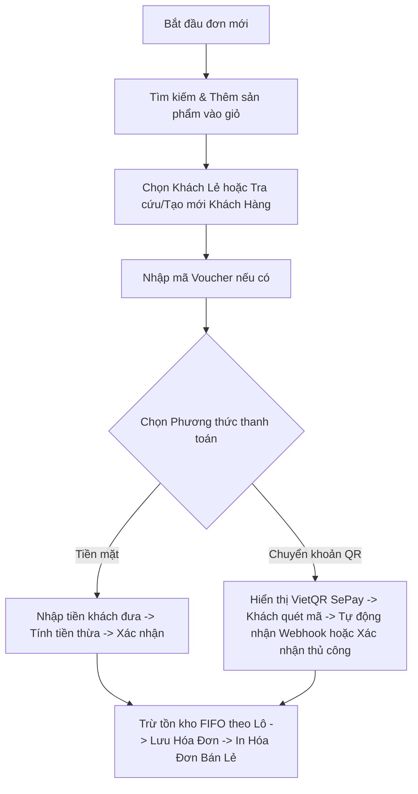
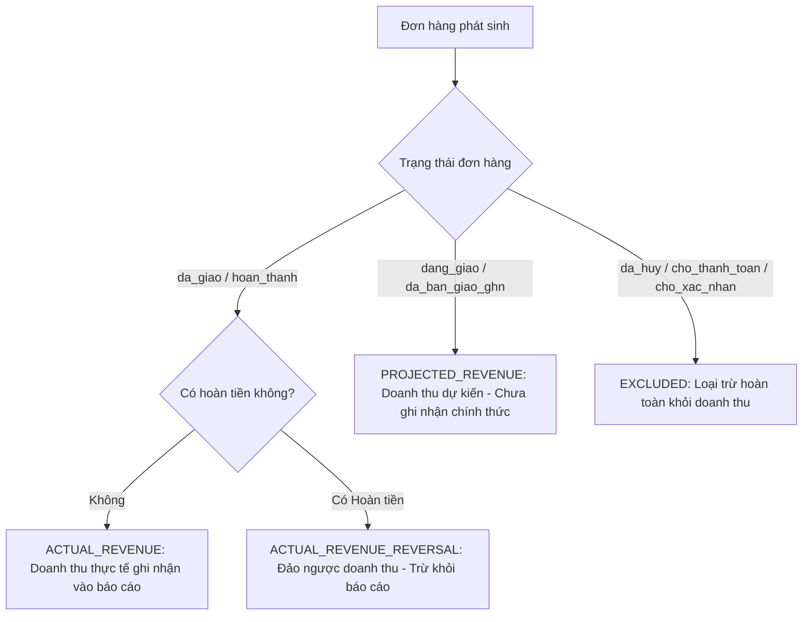

# TÀI LIỆU MÔ TẢ CHI TIẾT NGHIỆP VỤ & CHỨC NĂNG HỆ THỐNG
## 1. QUẢN LÝ KHUYẾN MÃI | 2. BÁN HÀNG TẠI QUẦY (POS) | 3. THỐNG KÊ & BÁO CÁO

---

## MỤC LỤC
1. [CHƯƠNG 1: QUẢN LÝ KHUYẾN MÃI (PROMOTIONS & DISCOUNTS)](#chuong-1-quan-ly-khuyen-mai)
   - [1.1. Tổng quan phân hệ](#11-tong-quan-phan-he)
   - [1.2. Phân hệ Đợt giảm giá (Campaign / Flash Sale)](#12-phan-he-dot-giam-gia)
   - [1.3. Phân hệ Phiếu giảm giá (Vouchers / Coupons)](#13-phan-he-phieu-giam-gia)
   - [1.4. Phân quyền & Giới hạn người dùng (Có thể & Không thể làm gì)](#14-phan-quyen-khuyen-mai)
2. [CHƯƠNG 2: BÁN HÀNG TẠI QUẦY (POS - POINT OF SALE)](#chuong-2-ban-hang-tai-quay-pos)
   - [2.1. Tổng quan và luồng hoạt động POS](#21-tong-quan-pos)
   - [2.2. Tìm kiếm & Quản lý giỏ hàng POS](#22-tim-kiem-gio-hang-pos)
   - [2.3. Quản lý thông tin khách hàng tại quầy](#23-quan-ly-khach-hang-pos)
   - [2.4. Xử lý thanh toán Tiền mặt & Chuyển khoản SePay QR](#24-xu-ly-thanh-toan-pos)
   - [2.5. Trừ tồn kho theo Lô (FIFO) & In hóa đơn bán lẻ](#25-ton-kho-fifo-in-hoa-don)
   - [2.6. Phân quyền & Giới hạn người dùng (Có thể & Không thể làm gì)](#26-phan-quyen-pos)
3. [CHƯƠNG 3: THỐNG KÊ & BÁO CÁO DOANH THU (ANALYTICS & REPORTING)](#chuong-3-thong-ke-va-bao-cao)
   - [3.1. Tổng quan hệ thống báo cáo](#31-tong-quan-thong-ke)
   - [3.2. Nguyên tắc phân loại & Tính toán doanh thu chuẩn mực](#32-nguyen-tac-doanh-thu)
   - [3.3. Các chiều dữ liệu phân tích & Báo cáo](#33-cac-chieu-du-lieu-thong-ke)
   - [3.4. Xuất file Excel báo cáo (Export Report)](#34-xuat-bao-cao-excel)
   - [3.5. Phân quyền & Giới hạn người dùng (Có thể & Không thể làm gì)](#35-phan-quyen-thong-ke)

---

# CHƯƠNG 1: QUẢN LÝ KHUYẾN MÃI (PROMOTIONS & DISCOUNTS)

### 1.1. Tổng quan phân hệ
Hệ thống Khuyến mãi của SMASH-VN được thiết kế chia thành 2 phân hệ độc lập nhằm đáp ứng đa dạng các chiến dịch tiếp thị:
1. **Đợt giảm giá (Campaign / Flash Sale)**: Tác động trực tiếp lên giá bán niêm yết của từng sản phẩm/biến thể. Khách hàng xem sản phẩm sẽ thấy ngay giá gốc (gạch ngang) và giá sau khi giảm.
2. **Phiếu giảm giá (Voucher / Coupon Code)**: Giảm giá trên tổng giá trị đơn hàng khi khách hàng hoặc thu ngân nhập mã giảm giá tại bước thanh toán.

Mọi thao tác thay đổi trạng thái, tạo mới, chỉnh sửa, xóa/ngưng hoạt động trong phân hệ khuyến mãi đều được tự động ghi lại tại bảng `EditLog` (Audit Trail) phục vụ truy vết bảo mật nội bộ.

---

### 1.2. Phân hệ Đợt giảm giá (Campaign / Flash Sale)

#### A. Cách thức hoạt động
- **Chiết khấu trực tiếp**: Mỗi đợt giảm giá áp dụng một tỷ lệ phần trăm chiết khấu (`% giảm giá`) lên các sản phẩm được chỉ định.
- **Tính toán giá hiển thị**: 
  $$\text{Giá khuyến mãi} = \text{Giá gốc} \times \left(1 - \frac{\text{Phần trăm giảm}}{100}\right)$$
- **Kiểu áp dụng (`kieuApDung`)**:
  - `MANUAL`: Quản trị viên tự tay chọn danh sách các sản phẩm cụ thể tham gia chương trình.
  - `PRICE_RANGE`: Tự động áp dụng cho tất cả các sản phẩm có khoảng giá từ `giaFrom` đến `giaDen`.
- **Gửi bản tin khuyến mãi tự động (Newsletter)**: Sau khi tạo đợt giảm giá thành công, hệ thống thông qua `NewsletterService` kích hoạt gửi email thông báo chương trình khuyến mãi đến toàn bộ khách hàng đã đăng ký nhận bản tin.

#### B. Quy tắc nghiệp vụ xử lý (Business Rules)
1. **Kiểm tra thời gian (Date & Time Validation)**:
   - **Không cho phép chọn thời gian bắt đầu trong quá khứ**: Khi tạo mới Đợt giảm giá, `ngayBatDau` phải lớn hơn hoặc bằng thời điểm hiện tại (`ngayBatDau >= now`). Nếu chọn thời gian trong quá khứ, hệ thống sẽ từ chối với thông báo: *"Thời gian bắt đầu không được nằm trong quá khứ!"*.
   - **Thứ tự thời gian**: Thời gian bắt đầu (`ngayBatDau`) phải **trước** thời gian kết thúc (`ngayKetThuc`) (`ngayKetThuc > ngayBatDau`).
2. **Giới hạn tỷ lệ giảm giá**:
   - Phần trăm giảm giá phải là số nguyên nằm trong khoảng từ `1%` đến `40%` (hoặc mức trần `MAX_CAMPAIGN_DISCOUNT_PERCENT` của hệ thống). Không cho phép giảm 0% hoặc lớn hơn giới hạn tối đa.
3. **Chống trùng lặp sản phẩm (Overlap Conflict Prevention)**:
   - Một sản phẩm **không thể** cùng lúc nằm trong 2 đợt giảm giá đang hoạt động có khoảng thời gian giao nhau.
   - Khi tạo hoặc cập nhật, hệ thống tự động quét toàn bộ sản phẩm được chọn: nếu phát hiện sản phẩm đã nằm trong chiến dịch khác đang chạy trong cùng khung giờ, giao dịch sẽ bị chặn lại và thông báo chi tiết mã đợt giảm giá bị xung đột.
4. **Tự động kích hoạt / Kết thúc theo thời gian thực**:
   - Hệ thống dựa vào mốc `LocalDateTime.now()` để xác định đợt giảm giá có đang hiệu lực hay không. Khi hết giờ, sản phẩm tự động quay về giá niêm yết ban đầu mà không cần can thiệp thủ công.

---

### 1.3. Phân hệ Phiếu giảm giá (Vouchers / Coupons)

#### A. Cách thức hoạt động
- **Mã Voucher độc nhất (`maPhieu`)**: Quản trị viên tạo mã (VD: `SMASH50K`, `HE2026`) viết hoa, không dấu, không chứa ký tự đặc biệt gây lỗi.
- **Hình thức chiết khấu (`donVi`)**:
  - `PERCENT` (`%`): Giảm theo tỷ lệ phần trăm trên tổng tiền hàng (VD: Giảm 10%, 20%). Bắt buộc thiết lập **Giá trị giảm tối đa** (`giaTriGiamToiDa`) để chặn trường hợp đơn giá trị quá lớn bị chiết khấu vượt mức an toàn.
  - `VND` (`đ`): Giảm một số tiền cố định trực tiếp vào đơn hàng (VD: Giảm 50.000 đ, 100.000 đ).
- **Điều kiện ràng buộc**:
  - `giaTriDonHangToiThieu`: Tổng tiền đơn hàng trước giảm phải đạt ngưỡng tối thiểu mới được áp dụng.
  - `soLuongConLai`: Tổng số lượt sử dụng voucher. Mỗi lần có đơn hàng thanh toán thành công, số lượng còn lại sẽ tự động trừ đi 1 (`soLuongConLai = soLuongConLai - 1`).

#### B. Quy tắc nghiệp vụ xử lý (Business Rules)
1. **Kiểm tra thời gian (Date & Time Validation)**:
   - **Không cho phép chọn thời gian bắt đầu trong quá khứ**: Khi tạo mới Voucher, `ngayBatDau` phải lớn hơn hoặc bằng thời điểm hiện tại (`ngayBatDau >= now`). Nếu chọn thời gian trong quá khứ, hệ thống sẽ từ chối với thông báo: *"Thời gian bắt đầu không được nằm trong quá khứ!"*.
   - **Thứ tự thời gian**: `ngayKetThuc > ngayBatDau`.
2. **Tính toán số tiền giảm (`VoucherCalculator`)**:
   - Nếu giảm theo `%`: 
     $$\text{Tiền giảm} = \min\left(\text{Tổng tiền hàng} \times \frac{\text{Giá trị}}{100},\; \text{Giá trị giảm tối đa}\right)$$
   - Nếu giảm theo `VNĐ`: 
     $$\text{Tiền giảm} = \min(\text{Giá trị giảm}, \text{Tổng tiền hàng})$$
   - Số tiền giảm không bao giờ được vượt quá tổng giá trị đơn hàng (tổng tiền thanh toán tối thiểu sau giảm là 0 đ).
3. **Quy tắc sử dụng**:
   - Mỗi đơn hàng chỉ được sử dụng **tối đa 01 voucher duy nhất** (không cộng dồn voucher).
   - Voucher chỉ có hiệu lực khi: `active == true`, `LocalDateTime.now()` nằm giữa `ngayBatDau` và `ngayKetThuc`, `soLuongConLai > 0`, và `tongTienDonHang >= giaTriDonHangToiThieu`.
4. **Cơ chế hoàn lượt voucher khi hủy đơn**:
   - Nếu đơn hàng trực tuyến hoặc đơn POS ở trạng thái `CHO_THANH_TOAN` bị hủy, hệ thống sẽ tự động hoàn trả lại +1 lượt sử dụng cho voucher đó (`soLuongConLai = soLuongConLai + 1`).

---

### 1.4. Phân quyền & Giới hạn người dùng trong Quản lý Khuyến mãi

| Đối tượng | Những gì CÓ THỂ làm | Những gì KHÔNG THỂ làm |
| :--- | :--- | :--- |
| **Quản trị viên (Admin)** | • Tạo mới, cập nhật, vô hiệu hóa/kích hoạt lại Đợt giảm giá & Voucher. • Thiết lập ngày bắt đầu, thời gian kết thúc, hạn mức tiền, tỷ lệ %, số lượt sử dụng. • Chọn sản phẩm áp dụng thủ công hoặc theo khoảng giá. • Xem lịch sử chỉnh sửa (Audit Trail) của toàn bộ khuyến mãi. | • Không thể chọn thời gian bắt đầu trong quá khứ khi tạo mới. • Không thể thiết lập thời gian kết thúc trước hoặc bằng thời gian bắt đầu. • Không thể tạo 2 voucher trùng mã (`maPhieu` bị trùng). • Không thể chọn sản phẩm đang nằm trong chiến dịch khuyến mãi khác trùng thời gian. • Không thể xóa vĩnh viễn voucher/đợt giảm giá đã có phát sinh đơn hàng (chỉ được tắt `active = false` để đảm bảo toàn vẹn dữ liệu kế toán). |
| **Nhân viên (Staff / Thu ngân)** | • Xem danh sách các mã khuyến mãi, đợt giảm giá đang hoạt động. • Tra cứu điều kiện áp dụng voucher để tư vấn cho khách hàng. | • Không có quyền tạo, sửa, xóa hoặc thay đổi giá trị khuyến mãi. • Không thể tự ý kích hoạt lại voucher đã hết hạn hoặc hết lượt. |
| **Khách hàng (Customer / Guest)** | • Xem giá khuyến mãi trực tiếp trên từng sản phẩm. • Nhập mã voucher tại bước giỏ hàng / thanh toán online để được giảm trừ. • Nhận email thông báo khi có đợt giảm giá mới (nếu đã đăng ký newsletter). | • Không thể áp dụng voucher khi đơn chưa đủ điều kiện tối thiểu. • Không thể dùng voucher đã hết hạn hoặc hết lượt sử dụng. • Không thể cộng dồn nhiều mã voucher trên cùng 1 đơn hàng. • Không thể can thiệp sửa đổi giá trị chiết khấu. |

---

# CHƯƠNG 2: BÁN HÀNG TẠI QUẦY (POS - POINT OF SALE)

### 2.1. Tổng quan và luồng hoạt động POS
Màn hình Bán hàng tại quầy (POS) là công cụ chuyên dụng dành cho Thu ngân / Nhân viên bán hàng tại cửa hàng trực tiếp của SMASH-VN, tối ưu hóa tốc độ tạo đơn, tra cứu và thu tiền.

**Quy trình nghiệp vụ chuẩn tại quầy:**

---

### 2.2. Tìm kiếm & Quản lý giỏ hàng POS
- **Tìm kiếm thông minh**: Tìm kiếm nhanh theo tên sản phẩm, ID biến thể, màu sắc, kích thước, trọng lượng vợt; kết hợp bộ lọc nhanh theo Danh mục và Thương hiệu. *(Lưu ý: Hệ thống định danh biến thể theo ID và tổ hợp thuộc tính, chưa hỗ trợ trường mã SKU tùy chỉnh của người dùng).*
- **Kiểm soát tồn kho tức thì**: Chỉ cho phép thêm vào giỏ các sản phẩm đang ở trạng thái kinh doanh (`dang_ban`) và có số lượng tồn kho khả dụng (`soLuongTon > 0`).
- **Thao tác giỏ hàng**: Tăng/giảm số lượng trực tiếp bằng nút bấm hoặc gõ số, tự động giới hạn không cho nhập vượt quá tồn kho thực tế trong kho, nút xóa dòng nhanh và xóa trắng giỏ hàng.

---

### 2.3. Quản lý thông tin khách hàng tại quầy
- **Khách Lẻ mặc định**: Mặc định hệ thống gán vào tài khoản Khách Lẻ nội bộ (`guest@smashvn.com` / `0000000000`) giúp thu ngân thanh toán ngay mà không bắt buộc xin thông tin khách vãng lai.
- **Tra cứu khách hàng thành viên**: Tìm kiếm tức thì qua Số điện thoại, Họ tên, Email để tích điểm và ghi nhận lịch sử mua hàng.
- **Tạo nhanh tài khoản khách hàng mới**: Thu ngân có thể mở modal đăng ký nhanh khách hàng ngay tại quầy (Họ tên, SĐT chuẩn 10 số, Email tùy chọn). Hệ thống tự động tạo `TaiKhoan` và mã hóa mật khẩu bằng BCrypt, lập tức gắn vào đơn hàng hiện tại.

---

### 2.4. Xử lý thanh toán Tiền mặt & Chuyển khoản SePay QR

#### A. Thanh toán Tiền mặt (Cash)
1. **Gợi ý mệnh giá nhanh**: Các nút chọn nhanh `50k`, `100k`, `200k`, `500k`, `Đúng số tiền` giúp thu ngân thao tác nhanh trong 1 chạm.
2. **Tính toán tiền thừa theo thời gian thực**: 
   $$\text{Tiền thối lại} = \text{Tiền khách đưa} - \text{Tổng thanh toán}$$
3. **Cơ chế Validate & Báo lỗi nghiêm ngặt**:
   - Nếu chưa nhập tiền hoặc nhập số tiền `<` tổng thanh toán: Ô nhập tiền lập tức chuyển viền đỏ (`is-invalid`), hiển thị dòng cảnh báo màu đỏ *"Số tiền khách đưa chưa đủ (còn thiếu X đ)"*, đồng thời dòng tiền thối hiển thị *"Thiếu X đ"*.
   - Nếu thu ngân bấm nút "Xác nhận", hệ thống chặn lại, bắn Toast cảnh báo và tự động `focus` vào ô nhập tiền.
4. **Hộp thoại xác nhận an toàn**: Khi tiền đưa hợp lệ (ô viền xanh `is-valid`), bấm xác nhận sẽ mở popup SweetAlert2 với ghi chú *“ℹ️ Vui lòng kiểm tra kỹ trước khi xác nhận”* trước khi chốt đơn.

#### B. Thanh toán Chuyển khoản SePay QR (Dynamic VietQR)
1. **Khởi tạo đơn Chờ thanh toán**: Khi chọn Chuyển khoản và bấm Thanh toán, hệ thống tạo bản ghi hóa đơn ở trạng thái `CHO_THANH_TOAN` và giữ chỗ tồn kho tạm thời.
2. **Tạo VietQR động**: Tự động sinh mã QR chứa chính xác số tài khoản, ngân hàng, số tiền cần trả và nội dung chuyển khoản bắt buộc (`HDSVN2026xxxx-xx`).
3. **Cơ chế bắt tiền tự động (Webhook / Polling)**:
   - Hệ thống chạy cơ chế Polling ngầm gọi SePay API mỗi 3 giây để kiểm tra giao dịch nổ tiền vào tài khoản.
   - Khi SePay gửi Webhook khớp số tiền và mã hóa đơn, hóa đơn tại quầy tự động chuyển trạng thái `DA_THANH_TOAN` / `da_giao`, đóng modal QR và bật màn hình in hóa đơn.
4. **Xác nhận thủ công**: Nếu khách hàng chuyển khoản từ ngân hàng khác bị chậm Webhook, thu ngân sau khi kiểm tra app ngân hàng của shop có thể bấm *"Xác nhận đã nhận tiền (Thủ công)"* để hoàn tất đơn.
5. **Hủy đơn chuyển khoản**: Nếu khách đổi ý không mua, thu ngân bấm *"Hủy"*, hệ thống lập tức hủy hóa đơn chờ và hoàn trả tồn kho về trạng thái ban đầu.

---

### 2.5. Trừ tồn kho theo Lô (FIFO) & In hóa đơn bán lẻ
- **Khấu trừ tồn kho FIFO (First In - First Out)**:
  - Hệ thống `InventoryLotService` tự động nhóm các biến thể cùng thuộc tính (cùng màu, size, sức căng).
  - Khi thanh toán, hệ thống khóa bi-directional chống deadlock, kiểm tra tổng tồn khả dụng của nhóm biến thể. Nếu đủ, hệ thống tự động trừ tuần tự từ các đợt/lô nhập cũ nhất (`id` nhỏ hơn) sang các đợt mới hơn.
  - Nếu tổng tồn khả dụng không đủ, giao dịch sẽ bị từ chối (`INSUFFICIENT_STOCK`) và rollback an toàn, không bao giờ để âm kho.
  - Khi hủy đơn, hệ thống tự động hoàn kho chính xác vào từng đợt biến thể đã trừ trước đó.
- **In hóa đơn bán lẻ (Receipt Print)**:
  - Sau khi thanh toán thành công, hệ thống hỗ trợ mở giao diện in hóa đơn chuẩn khổ 80mm/K80 hoặc khổ A5 gồm đầy đủ: Tên shop, địa chỉ, mã hóa đơn `HDSVN...`, tên nhân viên thu ngân, chi tiết từng món hàng, giảm giá voucher, tổng tiền, tiền khách đưa, tiền thừa và lời cảm ơn.
  - **Lưu ý về tra cứu hóa đơn**: Khách hàng tra cứu đơn hàng thông qua trang tra cứu trực tuyến bằng cách nhập **Mã đơn hàng (`maHoaDon`) + Email hoặc Số điện thoại**. Hóa đơn in ra chỉ hiển thị mã hóa đơn dạng text, không in mã QR tra cứu (mã QR chỉ dùng cho bước chuyển khoản ngân hàng SePay lúc thanh toán).

---

### 2.6. Phân quyền & Giới hạn người dùng trong Bán hàng tại quầy (POS)

| Đối tượng | Những gì CÓ THỂ làm | Những gì KHÔNG THỂ làm |
| :--- | :--- | :--- |
| **Thu ngân / Nhân viên bán hàng** | • Tra cứu sản phẩm, kiểm tra số lượng tồn kho. • Thêm sản phẩm vào giỏ, điều chỉnh số lượng. • Tra cứu hoặc tạo mới khách hàng. • Áp mã voucher hợp lệ của shop. • Thu tiền mặt, xem gợi ý tiền thừa. • Tạo mã QR SePay, chờ webhook hoặc xác nhận thủ công. • Lưu đơn chờ thanh toán hoặc hủy đơn chờ để hoàn kho. • In hóa đơn bán lẻ cho khách. | • **Không thể** bán sản phẩm đã hết hàng trong kho (`soLuongTon = 0`). • **Không thể** thêm vào giỏ sản phẩm đã ngưng kinh doanh. • **Không thể** xác nhận thanh toán tiền mặt khi khách đưa thiếu tiền. • **Không thể** tự ý sửa đơn giá sản phẩm trực tiếp trên màn hình POS (giá bán được bảo vệ theo giá niêm yết/khuyến mãi của hệ thống). • **Không thể** áp dụng voucher khi đơn chưa đủ giá trị tối thiểu hoặc voucher đã hết hạn/lượt. |
| **Quản trị viên (Admin)** | • Thực hiện toàn bộ quyền như Thu ngân. • Xem lại lịch sử tất cả hóa đơn bán tại quầy trong tab *"Bán hàng tại quầy"* của Quản lý đơn hàng. • Xem nhật ký kiểm toán (Audit Log) ai là người thực hiện thu ngân đơn hàng đó. | • Không thể sửa đổi nội dung các dòng sản phẩm của hóa đơn đã hoàn thành (đảm bảo tính toàn vẹn chứng từ tài chính). |

---

# CHƯƠNG 3: THỐNG KÊ & BÁO CÁO DOANH THU (ANALYTICS & REPORTING)

### 3.1. Tổng quan hệ thống báo cáo
Phân hệ Thống kê & Báo cáo (`AdminThongKeService`) cung cấp cho Ban quản trị góc nhìn toàn diện, chính xác và trực quan theo thời gian thực về tình hình kinh doanh, dòng tiền, sức khỏe tài chính và hiệu quả vận hành của chuỗi cửa hàng SMASH-VN.

---

### 3.2. Nguyên tắc phân loại & Tính toán doanh thu chuẩn mực

Để đảm bảo số liệu kế toán không bị ảo, hệ thống áp dụng bộ quy tắc phân loại đơn hàng (`OrderClassifier` & `RevenueClassification`):

1. **Doanh thu thực tế (`ACTUAL_REVENUE`)**:
   - **Chỉ tính** các đơn hàng đã giao thành công và hoàn tất (`trangThaiDonHang IN ('da_giao', 'hoan_thanh')`).
   - Bao gồm cả đơn bán tại quầy đã thanh toán thành công và đơn online đã giao tận tay khách hàng.
2. **Đảo ngược / Khấu trừ doanh thu hoàn hàng (`ACTUAL_REVENUE_REVERSAL`)**:
   - Với các đơn hàng đã hoàn tất trước đó nhưng sau đó phát sinh trả hàng - hoàn tiền thành công (`trangThaiThanhToan == 'REFUNDED'` hoặc `RefundStatus.COMPLETED`), số tiền hoàn sẽ được ghi nhận là khoản giảm trừ doanh thu thực tế.
3. **Doanh thu dự kiến (`PROJECTED_REVENUE`)**:
   - Đơn COD đang trên đường giao hoặc đơn thanh toán trước đang vận chuyển. Số tiền này chỉ mang tính tham khảo dự báo dòng tiền, **không cộng gộp** vào doanh thu thực tế.
4. **Loại trừ hoàn toàn (`EXCLUDED`)**:
   - Các đơn hủy (`da_huy`), đơn chờ thanh toán (`cho_thanh_toan`), đơn chưa xác nhận (`cho_xac_nhan`) tuyệt đối không được đưa vào doanh thu.

---

### 3.3. Các chiều dữ liệu phân tích & Báo cáo

#### A. Bộ lọc thời gian linh hoạt (Presets & Custom Date)
- **Hôm nay (`today`)**: Thống kê từ 00:00:00 đến 23:59:59 ngày hiện tại.
- **Tuần này (`this_week`)**: Tính từ Thứ Hai đầu tuần đến hiện tại.
- **Tháng này (`this_month`)**: Tính từ ngày 1 của tháng đến hiện tại.
- **Năm nay (`this_year`)**: Tính từ ngày 01/01 đến hiện tại.
- **30 ngày gần nhất (`last_30_days`)**: So sánh xu hướng 30 ngày.
- **Tùy chỉnh khoảng ngày (`custom`)**: Cho phép chọn ngày bắt đầu (`startDate`) và ngày kết thúc (`endDate`) bất kỳ.

#### B. Các chỉ số & Biểu đồ phân tích chính
1. **Thẻ chỉ số tổng quan (KPI Cards)**:
   - **Tổng doanh thu thực tế**: Tổng tiền thu được từ các đơn thành công sau khi đã trừ voucher và đơn hoàn tiền.
   - **Lợi nhuận gộp**: $\text{Doanh thu} - \text{Giá vốn hàng bán (COGS theo giá nhập Lô)}$.
   - **Tổng số đơn hàng thành công & Tỷ lệ hủy đơn**: Cảnh báo nếu tỷ lệ hủy đơn vượt ngưỡng `15%`.
   - **Tăng trưởng doanh thu**: So sánh % tăng/giảm so với cùng kỳ trước (Tuần trước/Tháng trước).
2. **Biểu đồ xu hướng Doanh thu & Lợi nhuận (Timeline Chart)**:
   - Thể hiện trực quan đường biến thiên doanh thu theo từng ngày, từng tháng hoặc từng giờ trong ngày.
3. **Top Sản phẩm bán chạy nhất (Top 10 Best Sellers)**:
   - Xếp hạng sản phẩm theo số lượng bán ra và tổng doanh thu mang lại.
4. **Danh sách Sản phẩm bán chậm / Tồn kho lâu (Slow Moving Products)**:
   - Liệt kê các mặt hàng có lượng tồn lớn nhưng không phát sinh giao dịch trong 30–60 ngày để quản trị viên lên phương án khuyến mãi xả hàng.
5. **Cơ cấu Doanh thu theo Thương hiệu & Danh mục**:
   - Biểu đồ tròn (Donut chart) phân bổ tỷ trọng đóng góp doanh thu của từng hãng (Yonex, Victor, Lining...) và từng danh mục (Vợt, Giày, Áo, Phụ kiện...).

---

### 3.4. Xuất file Excel báo cáo (Export Report)
- Hệ thống tích hợp thư viện Apache POI (`XSSFWorkbook`) cho phép xuất dữ liệu thống kê ra file Excel `.xlsx` chuyên nghiệp:
  - Header bảng định dạng chuẩn màu sắc nhận diện SMASH-VN.
  - Số tiền được định dạng chuẩn tiền tệ Việt Nam (`#,##0 "đ"`).
  - Phân tách rõ ràng các sheet: Báo cáo tổng quan, Chi tiết đơn hàng thành công, Danh sách sản phẩm bán chạy, và Thống kê hàng tồn.

---

### 3.5. Phân quyền & Giới hạn người dùng trong Thống kê & Báo cáo

| Đối tượng | Những gì CÓ THỂ làm | Những gì KHÔNG THỂ làm |
| :--- | :--- | :--- |
| **Quản trị viên cấp cao (Admin / Chủ cửa hàng)** | • Toàn quyền truy cập bảng điều khiển Thống kê (`/admin/thong-ke`). • Lọc dữ liệu theo mọi mốc thời gian tùy ý (theo ngày, tháng, năm, tùy chọn). • Xem chi tiết doanh thu, giá vốn, lợi nhuận gộp và tỷ lệ tăng trưởng. • Xem phân tích tồn kho, sản phẩm bán chậm, tỷ lệ hủy đơn. • Xuất toàn bộ báo cáo ra file Excel `.xlsx`. | • Không thể tùy tiện can thiệp sửa số liệu doanh thu thô đã ghi nhận trong cơ sở dữ liệu (đảm bảo tính khách quan, chống gian lận nội bộ). |
| **Nhân viên / Thu ngân (Staff / Cashier)** | • Có thể xem báo cáo tóm tắt ca làm việc hoặc doanh số bán hàng trong ngày của chính mình (nếu được cấp quyền). | • **Không có quyền** truy cập màn hình Thống kê tài chính chuyên sâu và lợi nhuận của toàn hệ thống. • Không thể xem giá vốn nhập hàng gốc của sản phẩm. • Không thể xuất báo cáo tài chính tổng thể của doanh nghiệp. |
| **Khách hàng (Customer / Guest)** | • Hoàn toàn không có quyền truy cập vào bất kỳ chức năng thống kê nội bộ nào. | • Bị chặn bởi Spring Security (`403 Forbidden` / Chuyển hướng về trang đăng nhập). |

---

## TỔNG KẾT BẢO MẬT & TÍNH TOÀN VẸN HỆ THỐNG
1. **An toàn dữ liệu (Data Integrity)**: Toàn bộ thao tác thanh toán POS, trừ kho FIFO và áp voucher đều chạy trong `@Transactional`. Nếu có bất kỳ lỗi nào xảy ra (thiếu hàng, lỗi mạng, sai lệch tiền), giao dịch sẽ lập tức Rollback 100%, bảo vệ dữ liệu không bị thất thoát.
2. **Chống gian lận (Anti-Fraud)**: Số liệu thống kê được tính toán độc lập dựa trên hóa đơn thực tế đã đối soát hoàn tất, không phụ thuộc vào trạng thái giả lập.
3. **Truy vết toàn diện (Audit Trail)**: Mọi thao tác khuyến mãi, tạo đơn POS, hoàn hủy đều ghi rõ: ID nhân viên thao tác, thời gian chính xác, địa chỉ IP và nội dung chi tiết.
